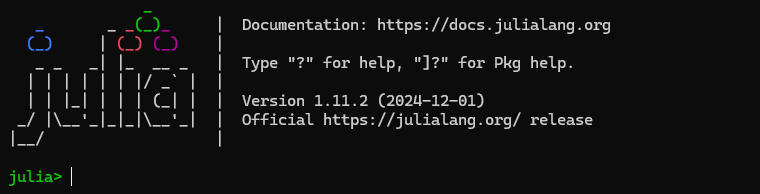

# Julia REPL

Julia's REPL (Read-Eval-Print Loop) is an interactive command-line interface that allows users to execute Julia code in real time. It provides a convenient way to experiment with code, test functions, and explore the language's features.

## Accessing the REPL
- In your terminal, type `julia` and hit Enter
- In VSCode, go to the command menu (<kbd>Cmd</kbd> + <kbd>⇧</kbd>+<kbd>P</kbd> on Mac, or <kbd>Ctrl</kbd> on Windows) and type `Julia: Start REPL`

You should be greeted by this screen. You can now execute Julia code as you please!




## REPL Modes

The Julia REPL has five modes of operation: Julian, Package, Help, Shell, and Search. All modes are activated by a specific key, and deactivated by pressing backspace. More details on each can be found [here](https://docs.julialang.org/en/v1/stdlib/REPL/#The-different-prompt-modes).

#### Julian Mode (default):
</br>
In Julian mode you are able to write and execute Julia code. For example, you could define a function and then call it.


#### Package Mode (activated by `]`):
</br>
In the package mode, you will see the currently active environment. The handle format is `(<env-name>) pkg>`. By default, the global environment for your current Julia version is active (e.g., @v1.11). Packages in this environment are always available. The package mode grants quick access to methods in the `Pkg` package. For example, you can type `add <package-name>` to install a package. Other useful commands include, `activate <env-path>`, `st`, `up`, `resolve`, `instantiate`. For example, `st` and `status` list all packages in the current environment:


The full documentation for the package manager can be found [here](https://pkgdocs.julialang.org/v1/).

#### Help Mode (activated by `?`):
</br>

In the help mode you can query the docstring for any function or struct availaible in the current environment. For example, when querying `cos` you should see


#### Shell Mode (activated by `;`)


The shell mode allows you to execute system commands. Windows shell commands are not supported. However, Powershell or command prompt can be entered by typing `cmd` or `powershell`. Example usage of `ls` on a Linux machine:


#### Search Mode
In all modes, the executed lines are saved and searchable. Just type `^R` (Ctrl + R for me) and it will open a reverse search prompt where you can search prior commands.


## Customization of the REPL

- [`OhMyREPL`](https://github.com/KristofferC/OhMyREPL.jl) is a package that adds some nice defaults for color-coding and syntax highlighting, you can add it to your environment by typing `] add OhMyREPL` from the REPL
- More customization:
    The `startup.jl` file in Julia is an optional file that can be used to execute custom code every time a Julia session starts. It can be useful for setting configurations, loading frequently used packages, or defining custom functions.
    - Location of startup.jl on different operating systems:
        - Linux/macOS:
            ```
            ~/.julia/config/startup.jl
            ```
        - Windows:
            ```
            C:\Users\YourUsername\.julia\config\startup.jl
            ```

## Environment setup
- To create a new project, use `]` to enter the package manager mode and then type `generate MyNewProject` to create a new project within the specified directory.
- Julia uses project-specific environments to manage dependencies by maintaining separate `Project.toml` and `Manifest.toml` files for each environment, ensuring that package versions are isolated and reproducible. You can activate and work within a specific environment using `Pkg.activate("path/to/project")`, allowing for flexible and independent package management across projects.
- `Pkg.instantiate()` is a Julia function used to install all the dependencies for a project, based on the information stored in the `Project.toml` and `Manifest.toml` files. Here’s what it does:
    - If your project has a `Manifest.toml` file, `Pkg.instantiate()` will install the exact versions of the packages listed there, ensuring that the environment is fully reproduced as specified.
    - If there’s no `Manifest.toml` file, but there’s a `Project.toml`, it will resolve and install the necessary package dependencies based on the `Project.toml` file, generating a new `Manifest.toml` in the process.
- After doing this in our repo, we can do: `Pkg.status()`, which displays the current status of the project, listing installed packages and their versions.