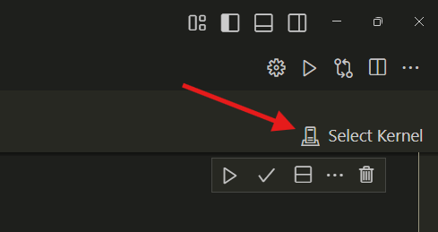
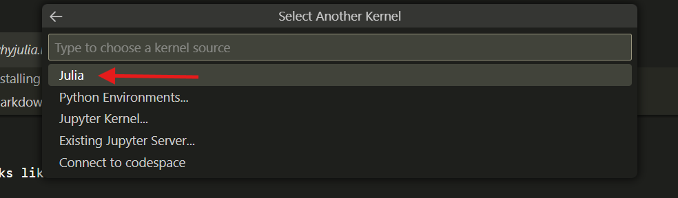
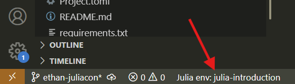
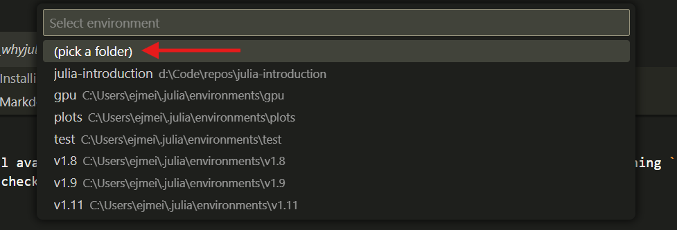

## Installing Julia

We will install Julia using the `juliaup` version manager. To install `juliaup` run:

##### Windows:
```sh
winget install --name Julia --id 9NJNWW8PVKMN -e -s msstore
```

##### Mac/Linux/FreeBSD: 
```sh
curl -fsSL https://install.julialang.org | sh
```

This will install the latest version of Julia by default. You can view all the installed julia versions by running (for you just one):

```sh
juliaup status
```

For me this looks like:

```sh
C:\Users\ejmei>juliaup status
 Default  Channel  Version                   Update
-------------------------------------------------------------------------------------------
          1.10     1.10.7+0.x64.w64.mingw32  Update to 1.10.10+0.x64.w64.mingw32 available
       *  1.11     1.11.2+0.x64.w64.mingw32  Update to 1.11.5+0.x64.w64.mingw32 available
          release  1.11.2+0.x64.w64.mingw32  Update to 1.11.5+0.x64.w64.mingw32 available
```

The `*` indicates the currently active version of Julia. You can switch the default by running `juliaup default <channel>`. For example,

```sh
juliaup default 1.11
```

We can list all available versions of Julia with `juliaup list` and choose one to install by running `juliaup add <channel>`. For more commands or non-default installations checkout the juliaup [GitHub page](https://github.com/JuliaLang/juliaup). 


## Download Lesson Materials
The raw Jupyter notebooks for this tutorial can be installed from the [GitHub page](https://github.com/MolSSI-Education/julia-introduction/tree/main/book) or by clicking one of the specific links:

1. [Introduction to Julia](https://github.com/MolSSI-Education/julia-introduction/blob/main/book/1_juliaintro.md)
2. [Julia Syntax](https://github.com/MolSSI-Education/julia-introduction/blob/main/book/2_syntax.ipynb)
3. [Why Julia](https://github.com/MolSSI-Education/julia-introduction/blob/main/book/3_whyjulia.ipynb)
4. [Numerical Data](https://github.com/MolSSI-Education/julia-introduction/blob/main/book/4_numericaldata.ipynb)
5. [Optimizing Julia Code](https://github.com/MolSSI-Education/julia-introduction/blob/main/book/5_optimization.ipynb)
6. [Advanced Topics](https://github.com/MolSSI-Education/julia-introduction/blob/main/book/6_advanced.ipynb)


## Environment Setup

If you wish to run the Juptyer notebooks locally, you will need to have Julia, VSCode and Jupyter Notebook. Furthermore, we require the [IJulia](https://github.com/JuliaLang/IJulia.jl) package, and two VSCode extensions: [Julia extension](https://marketplace.visualstudio.com/items?itemName=julialang.language-julia) and [Jupyter extension](https://marketplace.visualstudio.com/items?itemName=ms-toolsai.jupyter).

#### Install IJulia

IJulia is a Julia package which automatically installs Julia as a Jupyter kernel. This package should generally be installed in Julia's global package environment. To do so open the Julia REPL by typing `julia` in the command prompt which you installed `juliaup` into. By default, the initial environment is the correct one. Install IJulia by running:

```julia
using Pkg
Pkg.add("IJulia")
```

This might take a few minutes to finish. Once it's complete you can test by running:

```julia
using IJulia
notebook()
```

#### Activate the Kernel

Open VSCode and ensure that the Jupyter and Julia extensions are installed. Next open one of the Jupyter notebooks from the tutorial.

If the Julia kernel is not automatically detected click the `Select Kernel` button and then choose `Julia` from the dropdown and choose your desired Julia kernel.

<br></br>


#### Install Dependencies

Some of the notebooks require external packages to run, so we have to download those and active tell VSCode where to find them by activing the proper environment. To do this first install the `Project.toml` from the GitHub repo:
- [Project.toml](https://github.com/MolSSI-Education/julia-introduction/blob/main/book/Project.toml)

Place this in the same directory as your jupyter notebooks. If the Julia VSCode extension is running you will see a button to select the environment in the bottom left of VSCode.


Click this button and then choose `(pick a folder)` or if auto-detected the correct environment. The first time you use an environment, Julia must download and precompile all of your packages. It should only take a minute or two.


You should be all set now!
